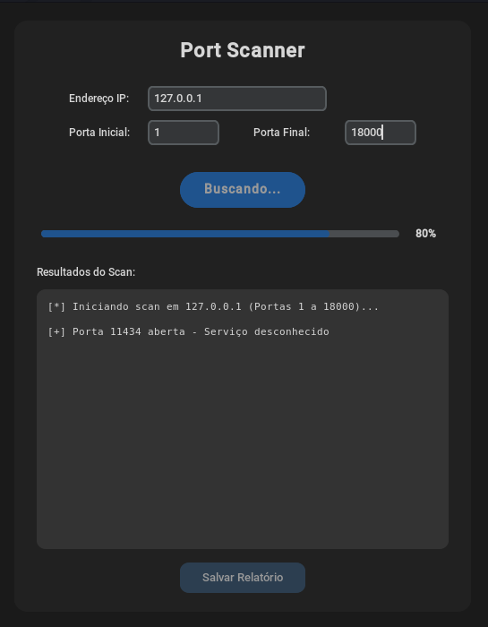

#  Python Port Scanner Visual


Uma ferramenta moderna, rápida e visual para varredura de portas de rede (Port Scanning), construída 100% em Python. Projetada para ser leve e eficiente, a aplicação utiliza processamento assíncrono (Threads) para garantir que a interface continue responsiva durante scans demorados.

##  Funcionalidades

* **Interface Moderna:** Interface gráfica elegante com suporte nativo a Modo Escuro usando `CustomTkinter`.
* **Processamento em Segundo Plano:** Utiliza `threading` para evitar o congelamento da UI durante a varredura.
* **Feedback em Tempo Real:** Barra de progresso dinâmica e log de terminal integrado.
* **Exportação de Relatórios:** Salve os resultados do scan facilmente em arquivos `.txt` ou `.csv` para análise posterior ou envio a clientes.
* **Cross-Platform:** Funciona perfeitamente em distribuições Linux (como Ubuntu/Mint) e Windows.

##  Como Executar o Projeto

### Pré-requisitos
Certifique-se de ter o Python 3.x instalado em sua máquina.

### Instalação

1. Clone este repositório:
   ```bash
   git clone [https://github.com/Mont0303/Port-Scanner](https://github.com/Mont0303/Port-Scanner)

    Navegue até a pasta do projeto:
    Bash

cd nome-do-repositorio

Instale as dependências necessárias:
Bash

pip install -r requirements.txt

Execute o aplicativo:
Bash

    python scanner.py

 Screenshots

 

 Autor

Montsserrat Veloso

    GitHub: @Mont0303


 Licença

Este projeto está sob a licença MIT. Veja o arquivo LICENSE para mais detalhes.